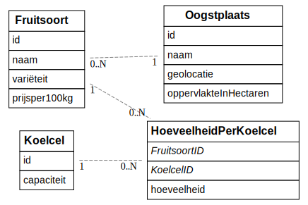

# Jonas Pauwels (202181093)

> Duid aan welke vakken je volgt en vermeld voor deze vakken de link naar jouw GitHub repository. In het geval je slechts één vak volgt, verwijder alle inhoud omtrent het andere vak uit dit document.
> Lees <https://github.com/adam-p/markdown-here/wiki/Markdown-Cheatsheet> om te weten hoe een Markdown-bestand opgemaakt moet worden.
> Verwijder alle instructies (lijnen die starten met >).

- [x] Web Services:
  - <https://github.com/Web-IV/2324-webservices-jonaspauwels>
  - <LINK_ONLINE_VERSIE_HIER>

**Logingegevens**

- Gebruikersnaam/e-mailadres:
- Wachtwoord:

> Vul eventueel aan met extra accounts voor administrators of andere rollen.

## Projectbeschrijving

### Omschrijving

Het project behandeld een stockbeheersysteem voor koelcellen in de landbouw, meer bepaald voor de fruitsector. Bedoeling is dat de landbouwer kan zien welk fruit van
welke boomgaard in welke koelcel zit en vice versa. Er wordt ook bijgehouden of een koelcel behandeld werd met een product. Als laatste worden ook de laatste veilingprijzen hieraan gelinkt.

### ERD

## API calls

> Maak hier een oplijsting van alle API cals in jouw applicatie. Groepeer dit per entiteit. Hieronder een voorbeeld.

### Oogstplaats

- `GET /api/oogstplaatsen`: alle oogstplaatsen ophalen
- `GET /api/oogstplaatsen/:id`: oogstplaats met een bepaald id ophalen
- `POST /api/oogstplaatsen` : nieuwe oogstplaats toevoegen
- `PUT /api/oogstplaatsen/:id`: oogstplaats met bepaald id aanpassen
- `DELETE /api/oogstplaatsen/:id`: oogstplaats met bepaald id verwijderen

### Fruitsoort

- `GET /api/fruitsoorten`: alle fruitsoorten ophalen
- `GET /api/fruitsoorten/:id`: fruitsoort met bepaald id ophalen
- `POST /api/fruitsoorten`: nieuwe fruitsoort toevoegen met hoeveelheid en koelcelid
- `PUT /api/fruitsoorten/:id`: fruitsoort met bepaald id aanpassen
- `DELETE /api/fruitsoorten/:id`: fruitsoort met bepaald id verwijderen

### Koelcel

- `GET /api/koelcellen`: alle koelcellen ophalen
- `GET /api/koelcellen/:id`: koelcel met bepaald id ophalen
- `POST /api/koelcellen`: nieuwe koelcel toevoegen
- `PUT /api/koelcel/:id`: koelcel met bepaald id aanpassen
- `DELETE /apie/koelcel/:id`: koelcel met bepaald id verwijderen

### Product

- `GET /api/producten`: alle producten ophalen
- `GET /api/producten/:id`: product met bepaald id ophalen
- `POST /api/producten`: nieuw product toevoegen
- `PUT /api/producten/:id`: product met bepaald id aanpassen
- `DELETE /api/producten/:id`: product met bepaald id verwijderen

### Behandeling

- `GET /api/behandelingen`: alle behandelingen ophalen
- `GET /api/behandelingen/:id`: behandeling met bepaald id ophalen
- `POST /api/behandelingen`: nieuwe behandeling toevoegen
- `PUT /api/behandelingen/:id`: behandeling met bepaald id aanpassen
- `DELETE /api/producten/:id`: behandeling met bepaald id verwijderen

## Behaalde minimumvereisten

> Duid per vak aan welke minimumvereisten je denkt behaald te hebben

### Front-end Web Development

- **componenten**

  - [ ] heeft meerdere componenten - dom & slim (naast login/register)
  - [ ] applicatie is voldoende complex
  - [ ] definieert constanten (variabelen, functies en componenten) buiten de component
  - [ ] minstens één form met meerdere velden met validatie (naast login/register)
  - [ ] login systeem
         

- **routing**

  - [ ] heeft minstens 2 pagina's (naast login/register)
  - [ ] routes worden afgeschermd met authenticatie en autorisatie
         

- **state-management**

  - [ ] meerdere API calls (naast login/register)
  - [ ] degelijke foutmeldingen indien API-call faalt
  - [ ] gebruikt useState enkel voor lokale state
  - [ ] gebruikt gepast state management voor globale state - indien van toepassing
         

- **hooks**

  - [ ] gebruikt de hooks op de juiste manier
         

- **varia**

  - [ ] een aantal niet-triviale e2e testen
  - [ ] minstens één extra technologie
  - [ ] maakt gebruik van de laatste ES-features (async/await, object destructuring, spread operator...)
  - [ ] duidelijke en volledige README.md
  - [ ] volledig en tijdig ingediend dossier en voldoende commits

### Web Services

- **datalaag**

  - [ ] voldoende complex (meer dan één tabel, 2 een-op-veel of veel-op-veel relaties)
  - [ ] één module beheert de connectie + connectie wordt gesloten bij sluiten server
  - [ ] heeft migraties - indien van toepassing
  - [ ] heeft seeds
         

- **repositorylaag**

  - [ ] definieert één repository per entiteit (niet voor tussentabellen) - indien van toepassing
  - [ ] mapt OO-rijke data naar relationele tabellen en vice versa - indien van toepassing
         

- **servicelaag met een zekere complexiteit**

  - [ ] bevat alle domeinlogica
  - [ ] bevat geen SQL-queries of databank-gerelateerde code
         

- **REST-laag**

  - [ ] meerdere routes met invoervalidatie
  - [ ] degelijke foutboodschappen
  - [ ] volgt de conventies van een RESTful API
  - [ ] bevat geen domeinlogica
  - [ ] geen API calls voor entiteiten die geen zin hebben zonder hun ouder (bvb tussentabellen)
  - [ ] degelijke authorisatie/authenticatie op alle routes
         

- **algemeen**

  - [ ] er is een minimum aan logging voorzien
  - [ ] een aantal niet-triviale integratietesten (min. 1 controller >=80% coverage)
  - [ ] minstens één extra technologie
  - [ ] maakt gebruik van de laatste ES-features (async/await, object destructuring, spread operator...)
  - [ ] duidelijke en volledige README.md
  - [ ] volledig en tijdig ingediend dossier en voldoende commits

## Projectstructuur

### Front-end Web Development

> Hoe heb je jouw applicatie gestructureerd (mappen, design patterns, hiërarchie van componenten, state...)?

### Web Services

> Hoe heb je jouw applicatie gestructureerd (mappen, design patterns...)?

## Extra technologie

### Front-end Web Development

> Wat is de extra technologie? Hoe werkt het? Voeg een link naar het npm package toe!

### Web Services

> Wat is de extra technologie? Hoe werkt het? Voeg een link naar het npm package toe!

## Testresultaten

### Front-end Web Development

> Schrijf hier een korte oplijsting en beschrijving van de geschreven testen

### Web Services

> Schrijf hier een korte oplijsting en beschrijving van de geschreven testen + voeg een screenshot van de coverage en uitvoering toe

## Gekende bugs

### Front-end Web Development

> Zijn er gekende bugs?

### Web Services

> Zijn er gekende bugs?

## Wat is er verbeterd/aangepast?

> Deze sectie is enkel voor 2e zittijd, verwijder deze in 1e zittijd.

### Front-end Web Development

- Dit en dat

### Web Services

- Oh en dit ook
