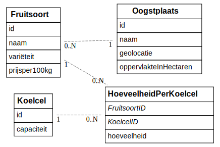
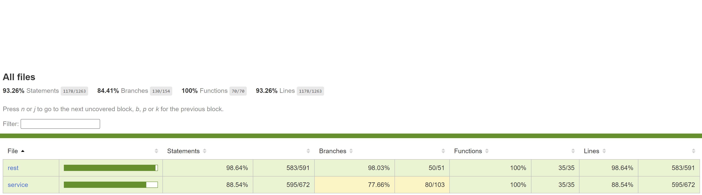
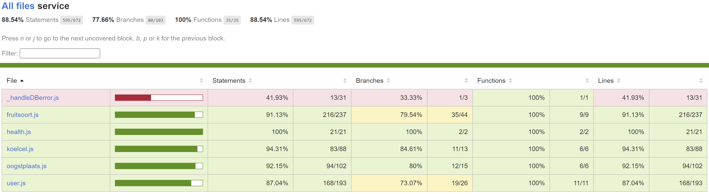
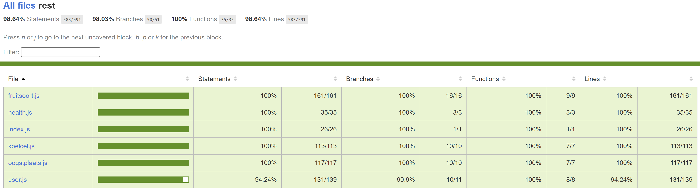
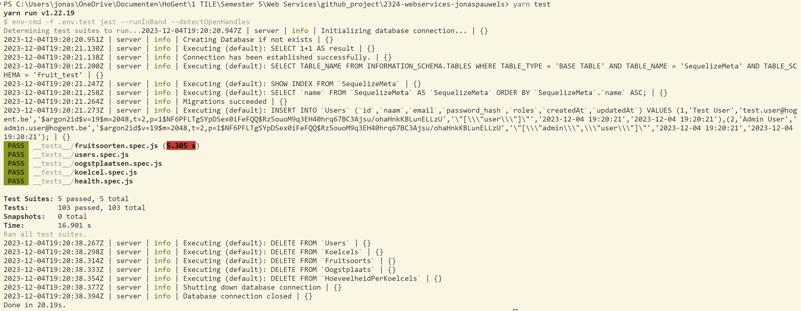

# Jonas Pauwels (202181093)

- [x] Web Services:
  - GitHub Repository: <https://github.com/Web-IV/2324-webservices-jonaspauwels>
  - Online versie: <https://webservice-jonaspauwels.onrender.com>

## Logingegevens

### admin

- Gebruikersnaam/e-mailadres: <jonas.pauwels@student.hogent.be>
- Wachtwoord: AppelenEnPeren

### gewone gebruiker

- Gebruikersnaam/e-mailadres: <per.zik@fruit.be>
- Wachtwoord: PerZiek

## Projectbeschrijving

### Omschrijving

Het project behandeld een stockbeheersysteem voor koelcellen in de landbouw, meer bepaald voor de fruitsector. Bedoeling is dat de landbouwer kan zien welk fruit van
welke oogstplaats in welke koelcel zit en vice versa.

### ERD



## API calls

### Oogstplaats

- `GET /api/oogstplaatsen`: alle oogstplaatsen ophalen
- `GET /api/oogstplaatsen/:id`: oogstplaats met een bepaald id ophalen
- `GET /api/oogstplaatsen/:oogstplaatsId/fruitsoorten`: alle fruitsoorten van één oogstplaats ophalen
- `POST /api/oogstplaatsen` : nieuwe oogstplaats toevoegen
- `PUT /api/oogstplaatsen/:id`: oogstplaats met bepaald id aanpassen
- `DELETE /api/oogstplaatsen/:id`: oogstplaats met bepaald id verwijderen

### Fruitsoort

- `GET /api/fruitsoorten`: alle fruitsoorten ophalen
- `GET /api/fruitsoorten/:id`: fruitsoort met bepaald id ophalen
- `GET /api/fruitsoorten/:fruitsoortId/koelcellen`: alle koelcellen van één fruitsoort ophalen
- `POST /api/fruitsoorten`: nieuwe fruitsoort toevoegen met oogstplaats
- `POST /api/fruitsoorten/:fruitsoortId/koelcellen/:koelcelid`: hoeveelheid toevoegen van fruitsoort in een koelcel
- `PUT /api/fruitsoorten/:fruitsoortId/koelcellen/:koelcelid`: hoeveelheid aanpassen van fruitsoort in een koelcel
- `PUT /api/fruitsoorten/:id`: fruitsoort met bepaald id aanpassen
- `DELETE /api/fruitsoorten/:id`: fruitsoort met bepaald id verwijderen

### Koelcel

- `GET /api/koelcellen`: alle koelcellen ophalen
- `GET /api/koelcellen/:id`: koelcel met bepaald id ophalen
- `GET /api/koelcellen/:koelcelId/fruitsoorten`: alle fruitsoorten van één koelcel ophalen
- `POST /api/koelcellen`: nieuwe koelcel toevoegen
- `PUT /api/koelcellen/:id`: koelcel met bepaald id aanpassen
- `DELETE /api/koelcellen/:id`: koelcel met bepaald id verwijderen

## Behaalde minimumvereisten

### Web Services

- **datalaag**

  - [x] voldoende complex (meer dan één tabel, 2 een-op-veel of veel-op-veel relaties)
  - [x] één module beheert de connectie + connectie wordt gesloten bij sluiten server
  - [x] heeft migraties - indien van toepassing
  - [x] heeft seeds

- **repositorylaag**

  - [ ] definieert één repository per entiteit (niet voor tussentabellen) - indien van toepassing
  - [ ] mapt OO-rijke data naar relationele tabellen en vice versa - indien van toepassing

- **servicelaag met een zekere complexiteit**

  - [x] bevat alle domeinlogica
  - [ ] bevat geen SQL-queries of databank-gerelateerde code

- **REST-laag**

  - [x] meerdere routes met invoervalidatie
  - [x] degelijke foutboodschappen
  - [x] volgt de conventies van een RESTful API
  - [x] bevat geen domeinlogica
  - [x] geen API calls voor entiteiten die geen zin hebben zonder hun ouder (bvb tussentabellen)
  - [x] degelijke authorisatie/authenticatie op alle routes

- **algemeen**

  - [x] er is een minimum aan logging voorzien
  - [x] een aantal niet-triviale integratietesten (min. 1 controller >=80% coverage)
  - [x] minstens één extra technologie
  - [x] maakt gebruik van de laatste ES-features (async/await, object destructuring, spread operator...)
  - [x] duidelijke en volledige README.md
  - [x] volledig en tijdig ingediend dossier en voldoende commits

## Projectstructuur

De boomstructuur van mijn project ziet er als volgt uit:

```bash
├───config
├───misc
├───src
│   ├───core
│   ├───data
│   │   ├───migrations
│   │   └───seeders
│   ├───rest
│   └───service
└───__tests__
    └───common
```

- config map:
  - de nodige configuration files
- misc:
  - o.a. printscreen van het ERD-schema evenals de code om dit te bekomen
  - images voor het dossier
- src:
  - map waarin alle 'werk'-files staan
    - core:
      - bronmodules die in andere modules gebruikt kunnen worden
    - data:
      - hier wordt de verbinding met de database tot stand gebracht en beheerd
      - de nodige modellen voor sequelize staan in de 'model.js' module
      - ook migrations en seeders worden hier aangemaakt en bewaard
    - rest:
      - beheert alle modules die te maken hebben met routing naar de juiste endpoints
    - service:
      - hier staat de domeinlogica die ervoor zorgt dat de juiste informatie op de juiste plek
    - \_\_tests\_\_:
      - hierin staan de nodige tests om na te gaan of de validatie of Service Errors op de correcte manier en op het juiste moment gegooid worden
      - elk endpoint heeft zijn eigen test suite in een eigen module
      - in de common map staat een hulpmodules die nodig is voor de test suites

## Extra technologie

### Andere ORM: Sequelize

- npm package: <https://www.npmjs.com/package/sequelize>

#### Werking

- Bij sequelize maak je modellen aan van de tabellen die je nodig hebt. Per model geef je dan de kolomnamen en nodige info voor de database mee (datatype, unieke velden, allowNull...).
- Via de modellen leg je ook de associaties tussen de verschillende tabellen.
- Eens het model gemaakt is kan je dit synchroniseren met je database.
- Daarna kan je via deze modellen met eenvoudige statements data toevoegen, wijzigen, opvragen en verwijderen uit de database.
- Sequelize ondersteunt ook migrations en seeders.

## Testresultaten

- voor alle endpoints werd voor elke route gekeken of:
  - validatie-errors correct, duidelijk en op het juiste moment gegooid worden
    - controleert op foutieve invoer
  - ServiceErrors correct duidelijk en op het juiste moment gegooid worden
    - mogelijke ServiceErrors
      - record met bepaald id komt niet voor in de database (bij opvragen, updaten of deleten met een bepaald id)
      - bij het toevoegen of updaten van hoeveelheden wordt ook gekeken of er nog wel voldoende vrije capaciteit is voor deze toevoeging/update

### Coverage Report

- overview:
  

- service:
  

- rest:
  

### Uitvoering



## Gekende bugs

Er zijn geen gekende bugs.

## Extra
